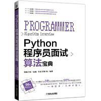
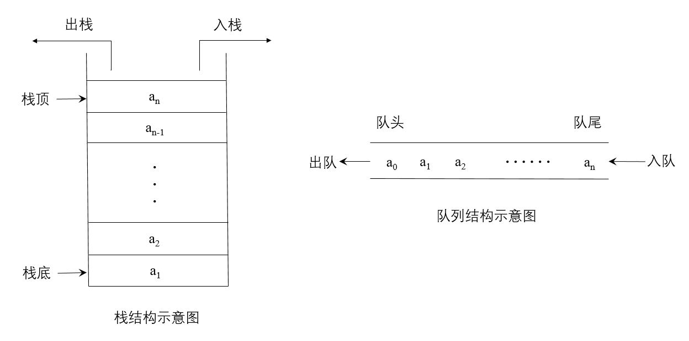

# Python程序员面试算法宝典

**ghs,2019-10.28**

&emsp;&emsp;本项目用于复现**猿媛之家**书籍《**Python程序员面试算法宝典**》中算法代码。书中代码采用Python2实现。本人参照作者思路，用Python3进行编程复现。



## 常用数据结构实现

&emsp;&emsp;本块主要列举书中所涉及到的数据结构的实现。其中都用Python进行编译。

| 对应章节 |             数据结构              |
| :------: | :-------------------------------: |
|    1     |           [链表](#链表)           |
|    2     | [栈、队列和哈希](#栈、队列和哈希) |
|    3     |              二叉树               |
|    4     |               数组                |
|    5     |              字符串               |
|    6     |           基本数字运算            |
|    7     |          排列组合与概率           |
|    8     |               排序                |
|    9     |              大数据               |


## 链表

&emsp;&emsp;在Python中，没有指针的概念，而类似指针的功能都是通过引用来实现的，为了方便理解，我仍使用指针来进行描述，而在实现的代码中，都是通过引用来建立结点之间的关系。

&emsp;&emsp;单链表数据结构的定义实例

```python
class LNode:
    def __init__(self,x):
        self.data = x
        self.next = None
```

&emsp;&emsp;另外，Python中没有数组的数据结构，但是列表和数组很像。本书代码中均采用列表来表示有序数组。

| 序号 |                         问题                         | 难度 |                             代码                             |                 原理                 |
| :--: | :--------------------------------------------------: | :--: | :----------------------------------------------------------: | :----------------------------------: |
|  1   |          [链表的逆序](ch1_list/Problems.py)          |  3   | 1.[就地逆序](ch1_list/1_1.py)2.[递归法](ch1_list/1_2.py)3.[插入法](ch1_list/1_3.py) |   [Reverse](ch1_list/thinking1.py)   |
|  2   |      [无序链表移除重复项](ch1_list/Problems.py)      |  3   |   1.[顺序删除](ch1_list/2_1.py)2.[递归法](ch1_list/2_2.py)   |   [Delete](ch1_list/thinking1.py)    |
|  3   |   [计算两个单链表表示数之和](ch1_list/Problems.py)   |  3   |                 [链表相加法](ch1_list/3.py)                  |    [Count](ch1_list/thinking1.py)    |
|  4   |        [链表的重新排序](ch1_list/Problems.py)        |  3   |               [中间结点逆序法](ch1_list/4.py)                |   [Reorder](ch1_list/thinking1.py)   |
|  5   |   [找出单链表的倒数第k个数](ch1_list/Problems.py)    |  3   |                 [快慢指针法](ch1_list/5.py)                  |    [Find](ch1_list/thinking2.py)     |
|  6   |      [检测单链表是否有环](ch1_list/Problems.py)      |  4   |               [快慢指针遍历法](ch1_list/6.py)                |    [Test](ch1_list/thinking2.py)     |
|  7   |      [把链表相邻元素翻转](ch1_list/Problems.py)      |  3   |                 [就地逆序法](ch1_list/7.py)                  |    [Flip](ch1_list/thinking2.py)     |
|  8   |  [把链表以K个结点为一组翻转](ch1_list/Problems.py)   |  3   |                   [翻转法](ch1_list/8.py)                    |    [Flip](ch1_list/thinking2.py)     |
|  9   |       [合并两个有序链表](ch1_list/Problems.py)       |  3   |                 [指针指向法](ch1_list/9.py)                  |    [Merge](ch1_list/thinking3.py)    |
|  10  | [给定某结点的指针，删除该结点](ch1_list/Problems.py) |  4   |               [复制数据删除法](ch1_list/10.py)               |   [Delete](ch1_list/thinking3.py)    |
|  11  |  [判断两个无环单链表是否交叉](ch1_list/Problems.py)  |  4   |                  [尾结点法](ch1_list/11.py)                  | [IsIntersect](ch1_list/thinking3.py) |
|  12  |         [展开链接列表](ch1_list/Problems.py)         |  4   |                   [归并法](ch1_list/12.py)                   |    [Merge](ch1_list/thinking3.py)    |


## 栈、队列与哈希

&emsp;&emsp;栈与队列是在程序设计中被广泛使用的两种重要线性数据结构，都是在一个特定范围的存储单元中存储的数据，这些数据可以重新被取出使用。

&emsp;&emsp;不同的是，栈先存进去的数据最后只能最后被取出来，是LIFO(Last In First Out，后进先出)，它将进行顺序逆序，即先进后出，后进先出；队列，先排队先买，后排队后买，是FIFO(First In First Out，先进先出)，它保持进出顺序一致，即先进先出，后进后出。



| 序号 |                        问题                        | 难度 |                             代码                             |                 原理                  |
| :--: | :------------------------------------------------: | :--: | :----------------------------------------------------------: | :-----------------------------------: |
|  1   |       [实现栈](ch2_stack_queue/Problems.md)        |  3   | 1.[数组实现](ch2_stack_queue/1_1.py)2.[链表实现](ch2_stack_queue/1_2.py) | [Stack](ch2_stack_queue/thinking1.md) |
|  2   |      [实现队列](ch2_stack_queue/Problems.md)       |  3   | 1.[数组实现](ch2_stack_queue/2_1.py)2.[链表实现](ch2_stack_queue/2_2.py) | [Queue](ch2_stack_queue/thinking1.md) |
|  3   |       [翻转栈](ch2_stack_queue/Problems.md)        |  4   |                                                              | [Flip](ch2_stack_queue/thinking1.md)  |
|  4   |    [判断出栈序列](ch2_stack_queue/Problems.md)     |  3   |                                                              |                                       |
|  5   | [求栈中最小元素(O(1))](ch2_stack_queue/Problem.md) |  4   |                                                              |                                       |
|  6   |   [用栈模拟队列操作](ch2_stack_queue/Problem.md)   |  3   |                                                              |                                       |
|  7   |    [设计排序系统](ch2_stack_queue/Problems.md)     |  4   |                                                              |                                       |
|  8   |   [实现LRU缓存方案](ch2_stack_queue/Problems.md)   |  4   |                                                              |                                       |
|  9   | [从给定车票找出旅程](ch2_stack_queue/Problems.md)  |  3   |                                                              |                                       |
|  10  | [数组中找出条件数对](ch2_stack_queue/Problems.md)  |  3   |                                                              |                                       |

