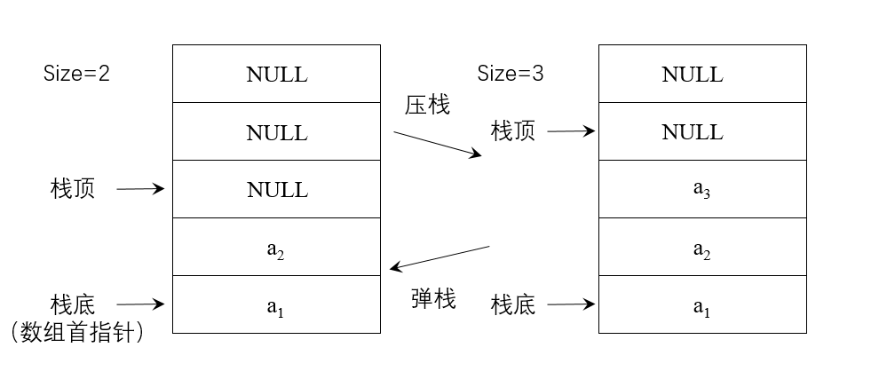
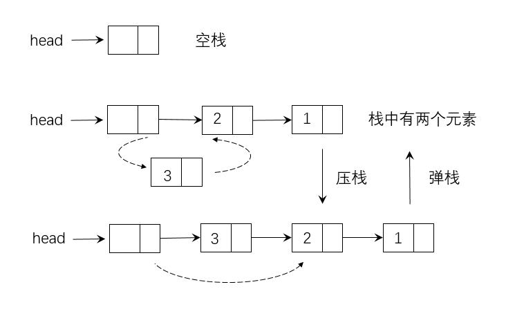

## 如何实现栈

&emsp;&emsp;栈的实现有两种方法，分别为采用数组来实现和采用链表来实现。

### 数组实现

&emsp;&emsp;在采用数组来实现栈的时候，栈空间是一段连续的空间。实现思路如下。

&emsp;&emsp;从上图可以看出，可以把数组的首元素当做栈底，同时记录栈中元素的个数size。假设数组首地址arr，压栈的操作其实是把待压栈的元素放到数组arr[size]中，然后执行size+操作；同理，弹栈其实是取数组arr[size-1]元素，然后执行size-操作。

### 链表实现

&emsp;&emsp;在创建链表的时候经常采用一种从头结点插入新结点的方法，最好采用带头结点的链表，这样可以保证对每个结点的操作都是相同的，实现思路如下图所示：

&emsp;&emsp;在上图中，进行压栈操作时，首先需要创建新的结点，把待压栈的元素放到新结点的数据域中，把新结点加到了链表首部就实现了压栈操作。同理，在弹栈时，只需要删除链表的第一个元素，从而实现弹栈操作。

### 算法性能分析

&emsp;&emsp;数组实现栈：优点是一个元素占用一个存储空间；缺点是如果初始化申请的存储空间太大，会造成空间的浪费，申请的存储空间太小，后期会经常需要扩充存储空间，造成性能下降。

&emsp;&emsp;链表实现栈：优点是使用灵活方便，只有在需要的时候才会申请空间；缺点是：除了要存储的元素外，还需要额外的存储空间存储指针信息。

&emsp;&emsp;压栈和弹栈的时间复杂度都为O(1)。

***

## 如何实现队列

&emsp;&emsp;与实现栈的方法类似，队列的实现也有两种方法，分别为采用数组或者链表来实现。

### 数组实现

&emsp;&emsp;用front来记录队列首元素的位置，用rear来记录队列尾元素后一个位置。入队列只需将带入元素放到rear的位置，同时执行rear+，出队列的时候只需执行front+即可。