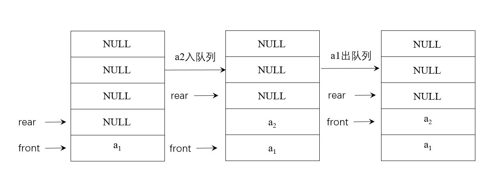
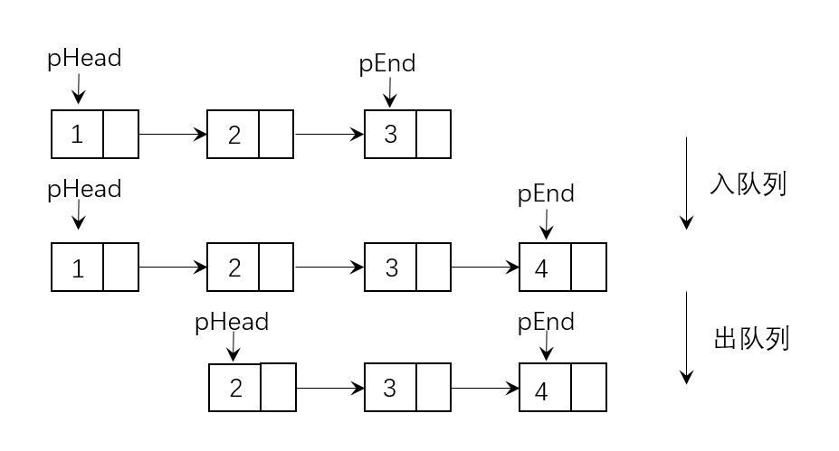

## 1.如何实现栈

&emsp;&emsp;栈的实现有两种方法，分别为采用数组来实现和采用链表来实现。

### 数组实现

&emsp;&emsp;在采用数组来实现栈的时候，栈空间是一段连续的空间。实现思路如下。

&emsp;&emsp;从上图可以看出，可以把数组的首元素当做栈底，同时记录栈中元素的个数size。假设数组首地址arr，压栈的操作其实是把待压栈的元素放到数组arr[size]中，然后执行size+操作；同理，弹栈其实是取数组arr[size-1]元素，然后执行size-操作。

### 链表实现

&emsp;&emsp;在创建链表的时候经常采用一种从头结点插入新结点的方法，最好采用带头结点的链表，这样可以保证对每个结点的操作都是相同的，实现思路如下图所示：

&emsp;&emsp;在上图中，进行压栈操作时，首先需要创建新的结点，把待压栈的元素放到新结点的数据域中，把新结点加到了链表首部就实现了压栈操作。同理，在弹栈时，只需要删除链表的第一个元素，从而实现弹栈操作。

### 算法性能分析

&emsp;&emsp;数组实现栈：优点是一个元素占用一个存储空间；缺点是如果初始化申请的存储空间太大，会造成空间的浪费，申请的存储空间太小，后期会经常需要扩充存储空间，造成性能下降。

&emsp;&emsp;链表实现栈：优点是使用灵活方便，只有在需要的时候才会申请空间；缺点是：除了要存储的元素外，还需要额外的存储空间存储指针信息。

&emsp;&emsp;压栈和弹栈的时间复杂度都为O(1)。

***

## 2.如何实现队列

&emsp;&emsp;与实现栈的方法类似，队列的实现也有两种方法，分别为采用数组或者链表来实现。

### 数组实现

&emsp;&emsp;用front来记录队列首元素的位置，用rear来记录队列尾元素后一个位置。入队列只需将带入元素放到rear的位置，同时执行rear+，出队列的时候只需执行front+即可。

&emsp;&emsp;最大缺点为：出队列后数组前半部分的空间不能被充分地利用，解决这个问题的方法为把数组看成一个环状空间(循环队列)。当数组最后一个位置被占用后，可以从数组首位置开始循环利用。

### 链表实现

&emsp;&emsp;分别用两个指针指向队列的首元素与尾元素。用pHead来指向队列的首元素，用pEnd来指向队列的尾元素。

&emsp;&emsp;显然用链表来实现队列有更好地灵活性，与数组的实现方法相比，他多了用来存储结点关系的指针空间。此外，也可以用循环链表来实现队列，这样只需要一个指向链表最后一个元素的指针即可。

***

## 3.翻转栈

&emsp;&emsp;最容易想到的办法是申请一个额外的队列，先把栈中的元素一次出栈放到队列里，然后把队列里的元素按照出列顺序入栈。缺点是需要申请额外的空间存储队列。此外，还可以用一种空间复杂度低的的递归方法。

### 递归

&emsp;&emsp;递归两个关键因素：递归定义和递归终止条件。递归定义：将当前栈的最底元素移到栈顶，其他元素顺次下移一位，然后对不包括栈顶元素的子栈进行相同操作。终止条件：递归直至栈为空。

&emsp;&emsp;此外，由于栈的后进先出的特点，使得只能取栈顶的元素，因此，要把栈底的元素移动到栈顶也需要递归调用才能完成，主要思路为：把不包含该栈顶元素的子栈的栈底的元素移动到子栈的栈顶，然后把栈顶的元素与子栈栈顶的元素进行交换。

### 性能分析

&emsp;&emsp;把栈底元素移动到栈顶操作的时间复杂度为O(N)，在翻转操作中对每个子栈都进行了把栈底元素移动到栈顶的操作，所以翻转算法的时间复杂度为O(N2)。

***

## 4.判断出栈序列

&emsp;&emsp;主要思路是用一个栈来模拟入栈顺序：

&emsp;&emsp;(1)把push序列依次入栈，直到栈顶元素等于pop序列的第一个元素，然后栈顶元素出栈，pop序列移动到第二个元素；

&emsp;&emsp;(2)如果栈顶继续等于pop序列现在的元素，则继续出栈并pop后移；否则对push序列继续入栈。

&emsp;&emsp;(3)如果push序列已经全部入栈，但pop序列未全部遍历，而且栈顶元素不等于当前pop元素，那么这个序列不是一个可能的出栈序列。如果栈为空，而且pop序列也全部被遍历过，则说明这是一个可能的pop序列。

### 性能分析

&emsp;&emsp;处理合理的pop序列的时候需要操作的次数最多，即把push序列进行一次压栈和出栈操作，次数为2N，因此，时间复杂度为O(N)，此外，这种方法使用了额外的栈空间，空间复杂度为O(N)。

***

## 5.求栈中最小元素O(1)

&emsp;&emsp;如果用一个变量来记录栈底的位置，通过遍历栈中所有的元素找出最小值，但是这种方法的时间复杂度为O(N)，那么如何用O(1)的时间复杂度来求出栈中最小的元素呢？

### 空间换时间

&emsp;&emsp;采用额外的存储空间来降低操作的时间复杂度。使用两个栈结构，一个栈用来存储数据，另外一个栈用来存储栈的最小元素。实现思路：1.如果当前入栈的元素比原来栈中的最小值还小，则把这个值压入保存最小元素的栈中；在出栈的时候，如果当前出栈的元素恰好为当前栈中的最小值，保存最小值的栈顶元素也出栈，使得当前最小值变为当前最小值入栈之前的那个最小值。

### 性能分析

&emsp;&emsp;申请了额外的一个栈空间来保存栈中的最小元素，从而达到了O(1)的时间复杂度求栈中最小元素的目的。

