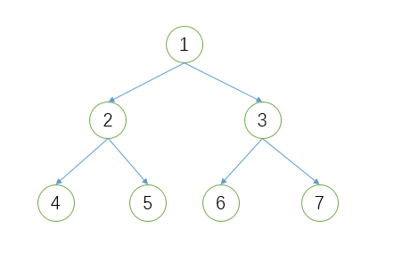
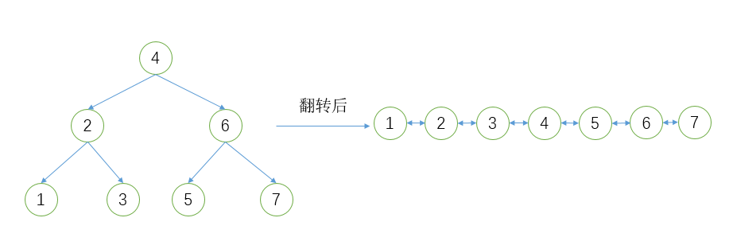
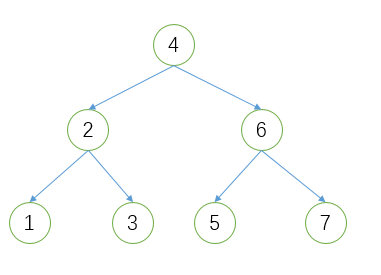
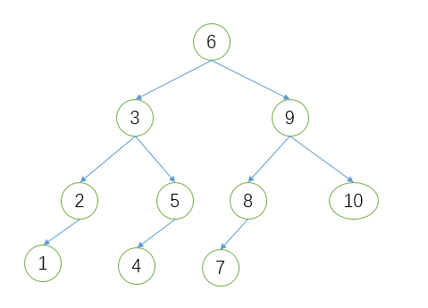
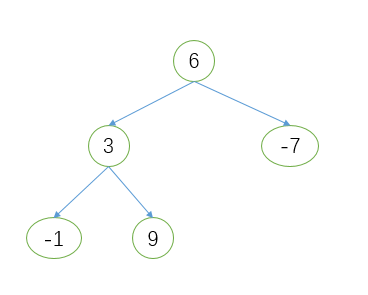
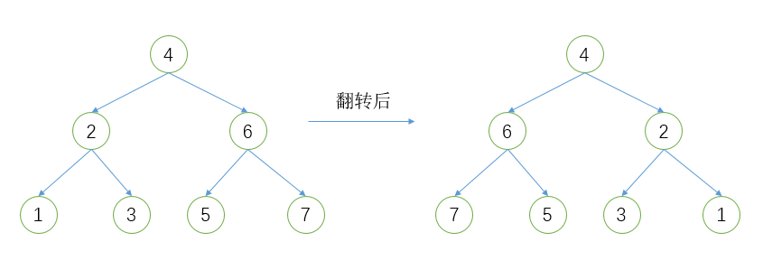
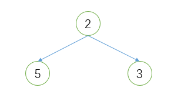

## 1.二叉树中放入有序整数数组

&emsp;&emsp;如何把一个有序整数数组放到二叉树中。

## 2.从顶部逐层打印结点数据

&emsp;&emsp;给定一棵二叉树，要求逐层打印二叉树结点的数据，例如有如下二叉树：

&emsp;&emsp;对这棵二叉树遍历的结果为1,2,3,4,5,6,7。

### 3.二叉树的最大子树和

&emsp;&emsp;给定一棵二叉树，它的每个节点都是正整数或非负数，如何找到一颗子树，使得它所有的结点的和最大？

### 4.判断二叉树相等

&emsp;&emsp;两棵二叉树相等是指这两棵二叉树有着相同的结构，并且在相同位置上的结点有相同的值。如何判断两棵二叉树是否相等？

### 5.二叉树转换为双向链表

&emsp;&emsp;输入一棵二元查找树，将该二元查找树转换成一个排序的双向链表。要求不能创建新的结点，只能调整结点的指向。例如：

## 6.判断数组是否是二元查找树后序遍历的序列

&emsp;&emsp;输入一个整数数组，判断该数组是否是某二元查找树的后续遍历的结果。如果是，返回true，否则返回false。例如数组[1,3,2,5,7,6,4]就是下图中二叉树的后序遍历序列。

### 7.找出排序二叉树任意两个结点的最近共同父结点

&emsp;&emsp;对于一棵给定的排序二叉树，求两个结点的共同父结点，例如在下图中，结点1和结点5的共同父结点为3。

### 8.复制二叉树

&emsp;&emsp;给定一个二叉树根结点，复制该树，返回新建树的根结点。

### 9.找出任意整数的所有路径

&emsp;&emsp;从树的根结点开始往下访问一直到叶子结点结果的所有结点形成一条路径。找出所有的这些路径，使其满足这条路径上所有结点数据的和等于给定的整数，例如：给定如下二叉树和整数8，满足条件的路径为6->3->-1(6+3-1=8)。

### 10.对二叉树进行镜像反转

&emsp;&emsp;二叉树的镜像就是二叉树对称的二叉树，就是交换每一个非叶子结点的左子树指针和右子树指针，如下图所示。注意：该树不一定是平衡树，也不一定有序。

### 11.二叉排序树中找出第一个大于中间值的结点

&emsp;&emsp;对于一棵二叉排序树，令f=(最大值+最小值)/2,设计一个算法，找出距离f值最近、大于f值的结点。例如，下图中的二叉排序树，最大值为7，最小值为1，因此，f=(1+7)/2=4，那么在这棵二叉树中，距离结点4最近并且大于4的结点为5.

## 12.找出路径最大的和

&emsp;&emsp;给定一棵二叉树，求各个路径的最大和，路径可以以任意结点作为起点和终点。比如给定以下二叉树：

&emsp;&emsp;最大和的路径为结点5->2->3，这条路径和为10。

### 13.实现反向DNS查找缓存

&emsp;&emsp;反向DNS查找指的是使用Internet IP地址查找域名。例如，如果你在浏览器中输入74.125.200.106，它会自动重定向到google.com。