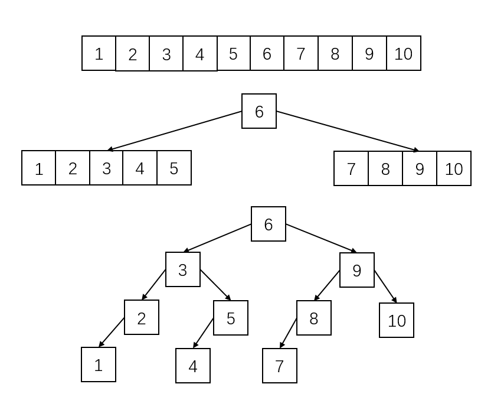

## 1.二叉树中放入有序整数数组

&emsp;&emsp;如果要把一个有序的整数数组放到二叉树中，那么所构造出来的二叉树必定也是一棵有序的二叉树。实现思路为：取数组的中间元素作为根结点，将数组分成左右两个部分，对数组的两部分分别用递归的方法分别构建左右子树。

&emsp;&emsp;如下图所示，首先取数组的中间结点6作为二叉树的根结点，然后对于左右两部分用同样的方法进行二叉树的构建。

&emsp;&emsp;由于这种方法只遍历了一次数组，因此，算法的时间复杂度为O(N)。

## 2.从顶部逐层打印结点数据

&emsp;&emsp;为了实现对二叉树的层序遍历，就要求在遍历一个结点的同时记录下它的孩子结点的信息，然后再从左到右的顺序来访问结点的数据，实现的时候可以采用队列来存储当前遍历到的结点的孩子结点，从而实现二叉树的层序遍历。

&emsp;&emsp;在二叉树的层序遍历中，对树中的各个结点只进行了一次访问，时间复杂度为O(N)；这种方法还使用了队列来保存遍历的中间结点，所用的队列的大小取决于二叉树中每一层中结点个数的最大值。具有N个结点的完全二叉树的深度为${\log _2}N + 1$，最底层的结点最多为N/2，算法的空间复杂度为O(N)。

## 3.二叉树的最大子树和

&emsp;&emsp;为了求出二叉树的最大子树和，可以针对每棵子树，求出子树中所有结点的和，然后从中找出最大值。恰好**后序遍历**能做到这一点。在对二叉树进行后序遍历的过程中，如果当前遍历的结点的值与其左右子树和的值相加结果大于最大值，则更新最大值。

&emsp;&emsp;这种方法与二叉树的后序遍历有相同的时间复杂度，O(N)。

## 4.判断二叉树相等

&emsp;如果两棵二叉树root1、root2相等，那么root1和root2结点的值相同，同时它们的左右孩子也有着相同的结构，并且对应位置上结点的值相等。可以用递归来判断两棵二叉树是否相等。

&emsp;&emsp;这种方法对两棵树只进行了一次遍历，因此，时间复杂度为O(N)。也没有申请额外的存储空间。