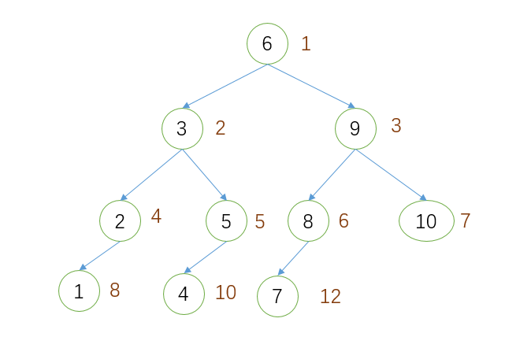

## 5.二叉树转换为双向链表

&emsp;&emsp;**二元查找树**:指一棵空树或者具有下列性质的二元树：若任意结点的左子树不空，则左子树上所有结点的值均小于它的根结点的值；若任意结点的右子树不空，则右子树上所有结点的值均大于它的根结点的值；任意结点的左、右子树也分别为二元查找树；没有键值相等的结点。

&emsp;&emsp;&emsp;这种方法与二叉树的中序遍历有着相同的时间复杂度O(N)；这种方法只用了两个额外的变量pHead和pEnd来记录双向链表的首尾结点，空间复杂度为O(1)。

## 6.判断数组是否是二元查找树后序遍历的序列

&emsp;&emsp;根据二元查找树、后序遍历的特点，这个序列的最后一个元素一定是树的根结点(结点4)，然后在数组中找到第一个大于根结点4的值5，那么结点5之前的序列(1,3,2)对应的结点一定位于结点4的左子树上，结点5及后面的序列一定位于结点4的右子树上。对于结点4的左子树遍历的序列(1,3,2)以及右子树的遍历序列(5,7,6)可以采用同样的方法来分析。

&emsp;&emsp;这种方法对数组只进行了一次遍历，时间复杂度为O(N)。

## 7.找出排序二叉树任意两个结点的最近共同父结点

### 7.1 路径对比法

&emsp;&emsp;对于一棵二叉树的两个结点，如果知道了从根结点到这两个结点的路径，就可以很容易地找出它们最近的公共父结点。因此，可以首先分别找出从根结点到这两个结点的路径。

&emsp;&emsp;**性能分析**：获取二叉树从根结点root到node结点的路径时，最差的情况是把树中所有结点都遍历了一遍，时间复杂度为O(N)，再找出离它们最近的公共父结点的时间复杂度也为O(N)，因此，时间复杂度为O(N)；这种方法用栈保存了路径，最坏的情况下，这个路径包含了树中的所有的结点，空间复杂度也为O(N)。

### 7.2 结点编号法

&emsp;&emsp;把二叉树看成是一棵完全二叉树，对结点进行编号。上图是对二叉树中的结点按照完全二叉树中的结点的编号方式进行编号，结点右边的数字为其对应的编号。

&emsp;&emsp;一个编号为n的结点，它的父亲结点的编号为n/2。假如要求node1和node2的最近的共同父结点，先分别求得这两个结点的编号n1、n2，然后每次找出n1和n2中较大的值除以2，知道n1=n2，此时的值就是它们最近的共同父结点的编号，接着根据编号信息找到对应的结点。

&emsp;&emsp;**性能分析**：时间复杂度为O(N)，求解的过程中只用了个别的几个变量，空间复杂度为O(1)。

## 8.复制二叉树

&emsp;&emsp;首先创造新的结点dupTree，然后根据root结点来构造dupTree结点，最后分别用root的左右子树来构造dupTree的左右子树。使用递归地方式实现。

&emsp;&emsp;**性能分析**：对二叉树进行了一次遍历，时间复杂度为O(N)，这种方法需要申请N个额外的存储空间来存储新的二叉树，空间复杂度为O(N)。

