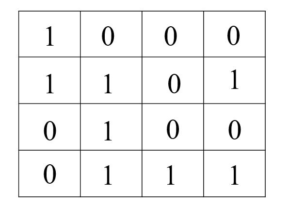

## 13.按要求构造数组

&emsp;&emsp;给定一个数组a[N]，希望构造一个新的数组b[N]，b[i]=a[0]* a[1]* a[2]...a[N-1]/a[i]。在构造数组的过程中，有如下几个要求：

1. 不允许使用除法；
2. 要求O(1)空间复杂度和O(N)的时间复杂度；
3. 除遍历计数器与a[N]、b[N]外，不可以使用新的变量；

## 14.求解迷宫问题

&emsp;&emsp;给定一个大小为NXN的迷宫，需要从迷宫的左上角走到迷宫的右下角，只能向右或向下，0表示没有路，1表示有路，比如，给定下面的迷宫：

## 15.三个有序数组中找公共元素

&emsp;&emsp;给定以非递减排序的三个数组，找出这三个数组中的所有公共元素。例如，给出三个数组:arr1=[2,5,12,30,45,85]，arr2=[16,19,20,85,200],arr3=[3,4,15,20,39,72,85,190]，那么这三个数组的公共元素为[20,85]。

## 16.对有大量重复元素的数组排序

&emsp;&emsp;给定一个数组，已知这个数组中有大量的重复元素，如何对这个数组进行高效地排序。

## 17.对任务进行调度

&emsp;&emsp;假设有一个中央调度机，有n个相同的任务需要调度到m台服务器上去执行，由于每台服务器的配置不一样，因此，服务器执行一个任务所花费的时间也不同。现在假设第i个服务器执行一个任务所花费的时间为t[i]。

&emsp;&emsp;例如：有2个执行机a与b，执行一个任务分别需要7min，10min，有6个任务待调度，如果平分这6个任务，即a与b各3个任务，则最短需要30min执行完所有。如果a分4个任务，b分2个任务，则最短28min执行完。请设计调度算法，使得所有任务完成所需要的时间最短，。输入m台服务器，每台机器处理一个任务的时间为t[i]，完成n个任务，输出n个任务在m台服务器的分布：estimate_process_time(t,m,n)。

## 18.对磁盘分区

&emsp;&emsp;有N个磁盘，每个磁盘大小为D[i]，现在要在这N个磁盘上“顺序分配”M个分区，每个分区大小为P[j]，顺序分配的意思是：分配一个分区P[j]时，如果当前磁盘剩余空间足够，则在当前磁盘分配；如果不够，则尝试下一个磁盘，直到找到一个磁盘D[i+k]可以容纳该分区，分配下一个分区P[j+1]时，则从当前磁盘D[i+k]的剩余空间开始分配，不再使用D[i+k]之前磁盘未分配的空间，如果这M个分区不能在这N个磁盘完全分配，则认为分配失败。

&emsp;&emsp;请实现函数，is_allocable判断给定N个磁盘和M个分区，是否会出现分配失败的情况？