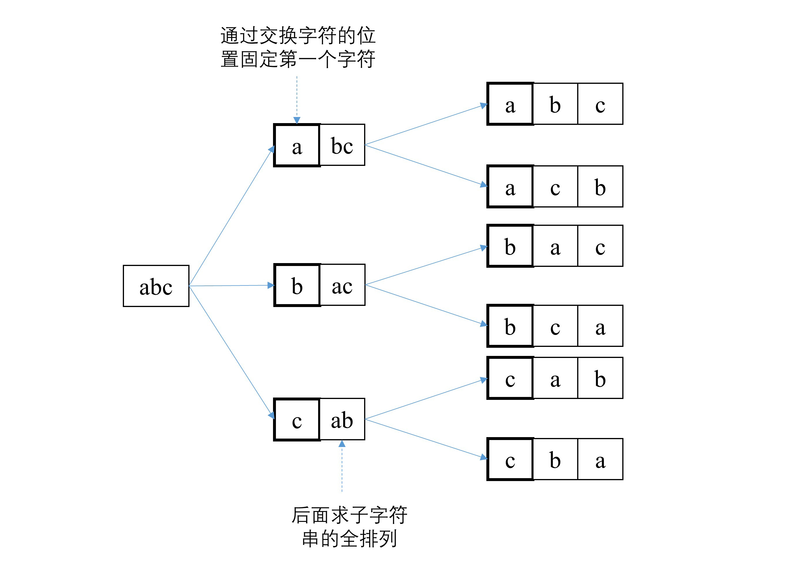

## 1.求字符串所有排列

### 1.1 递归法

&emsp;&emsp;以下以字符串abc为例介绍对字符串进行全排列的方法。具体步骤如下：

1. 首先固定一个字符a，然后对后面的两个字符b、c进行全排列；
2. 交换第一个字符与其后面的字符，即交换a、b，然后固定第一个字符b，接着对后面的两个字符a与c进行全排列；
3. 由于第2步交换了a、b破坏了字符串原来的顺序，因此，需要再次交换a、b使其恢复到原来的顺序，然后交换第一个字符和第三个字符，接着固定第一个字符c，对后面的两个字符a、b求全排列。

&emsp;&emsp;在使用递归方法求解的时候，需要注意以下两个问题：(1)逐渐缩小问题的规模，并且可以用相同的方法来求解子问题；(2)递归一定要有结束条件，否则会导致程序陷入死循环。

&emsp;&emsp;**性能分析**：假设这种方法需要的基本操作数为f(n)，那么f(n)=nf(n-1)=...n!。所以，算法的时间复杂度为O(n!)。算法在对字符进行交换的时候用到了常量个指针变量，因此，空间复杂度为O(1)。

### 1.2 非递归法

&emsp;&emsp;算法的主要思想为：从当前字符串出发找出下一个排列(下一个排列为大于当前字符串的最小字符串)。假设要对字符串"12345"进行排序。从"12543"->"13245"可以看出找下一个排列的主要思路为：

(1)从右到左找到两个相邻递增的字符串，例如"12543"，从右向左找出第一个相邻递增的子串为"25"；记录这个小的字符下标位pmin;

(2)找出pmin后面的比它大的最小的字符进行交换，交换'2''3'得到字符串"13542"；

(3)为了保证下一个排列为大于当前字符串的最小字符串，在第(2)步中完成交换后需要对pmin后的子串重新组合，使其值最小，只需要对pmin后面的字符进行逆序即可，逆序后就能保证当前组合是新的最小的字符串。

(4)当找不到相邻递增的子串时，说明找到了所有的组合。

&emsp;&emsp;需要注意的是，这种方法适用于字符串是按照升序排列的情况。因此，非递归的主要思路为：(1)首先对字符串进行排序；(2)依次获取当前字符串的下一个组合知道找不到相邻递增的子串为止。

## 2.求两个字符串的最长公共子串

## 3.对大小写字母组成的字符串排序

## 4.如何消除字符串的内嵌括号

## 5.实现字符串匹配

## 6.求字符串里最长的回文子串

